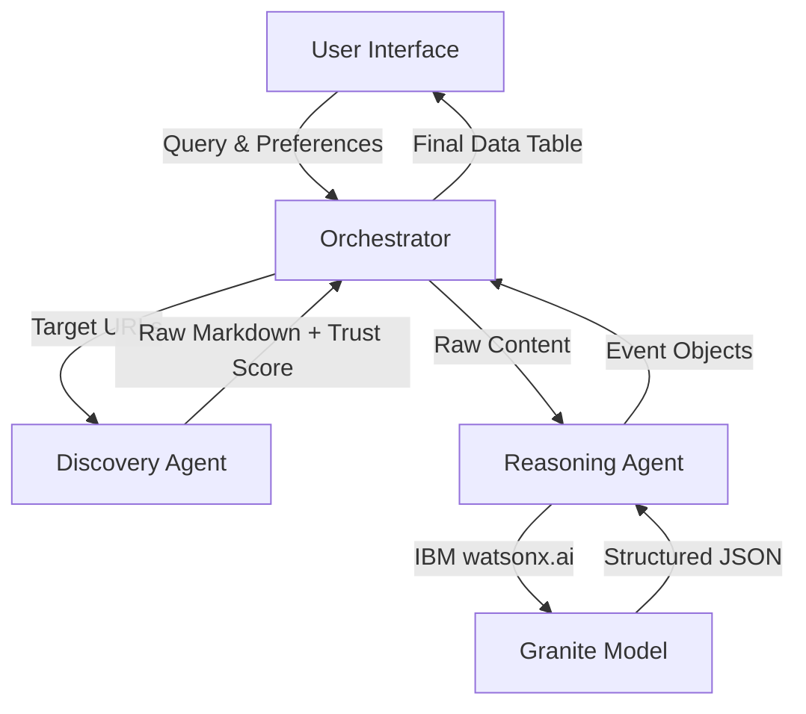

# AI Event Assistant

**AI Event Assistant** is an autonomous **Agentic RAG (Retrieval-Augmented Generation)** application designed to discover, filter, and analyze events (such as Operas, Theaters, and Hackathons) based on user preferences.

Unlike traditional search engines, this assistant orchestrates multiple AI agents to crawl web pages in real-time, extract unstructured data, and present it in a structured, reliable format with a calculated "Trust Score."

## Key Features

* ** Discovery Agent:** Utilizes `Crawl4AI` to perform high-speed, asynchronous web scraping of dynamic event websites (e.g., Ticketmaster, Government Opera sites).
* ** Reasoning Agent:** Powered by **IBM watsonx.ai (Granite Model)** to parse complex HTML/Markdown and extract structured data (Dates, Locations, Titles) into JSON.
* ** Reliability System:** Automatically calculates a "Trust Score" (0-10) for every source based on domain authority (e.g., `.gov`, `.edu`) and content verification.
* ** Asynchronous Architecture:** Built with `Asyncio` to handle multiple concurrent scraping tasks without blocking the user interface.
* ** Modern UI:** A responsive and interactive dashboard built with **Streamlit**.

## System Architecture

The project follows a **Multi-Agent Architecture** with a centralized Orchestrator pattern:



## Tech Stack

* **Language:** Python 3.10+
* **Frontend:** Streamlit
* **LLM & AI:** IBM watsonx.ai (Granite-3-8b-instruct)
* **Web Scraping:** Crawl4AI (Playwright based)
* **Concurrency:** Asyncio
* **Data Manipulation:** Pandas

## Installation & Setup

Follow these steps to run the project locally.

### 1. Clone the Repository

```bash
git clone https://github.com/yourusername/ai-event-assistant.git
cd ai-event-assistant

```

### 2. Create a Virtual Environment

```bash
python -m venv venv
# For Windows:
venv\Scripts\activate
# For Mac/Linux:
source venv/bin/activate

```

### 3. Install Dependencies

```bash
pip install -r requirements.txt

```

### 4. Install Browsers (Required for Crawl4AI)

```bash
playwright install

```

### 5. Configure Environment Variables

Create a `.env` file in the root directory and add your IBM Watsonx credentials:

```ini
WATSONX_URL=https://us-south.ml.cloud.ibm.com
WATSONX_APIKEY=your_ibm_api_key
PROJECT_ID=your_project_id

```

### 6. Run the Application

```bash
streamlit run app.py

```

## Project Structure

```text
/ai-event-assistant
│
├── app.py                # Main User Interface (Streamlit)
├── orchestrator.py       # Logic Controller (The "Brain")
├── .env                  # API Keys (GitIgnored)
│
├── agents/               # AI Agents Module
│   ├── __init__.py
│   ├── discovery.py      # Scraper Agent (Crawl4AI)
│   └── reasoning.py      # Analysis Agent (Watsonx)
│
└── requirements.txt      # Project Dependencies

```

## Roadmap

* [ ] **Smart Caching:** Cache results to reduce API costs and latency.
* [ ] **Calendar Integration:** Add "Add to Google Calendar" button for events.
* [ ] **Email Notifications:** Alert users when new hackathons are announced.
* [ ] **Multi-Language Support:** Auto-translate event descriptions.
